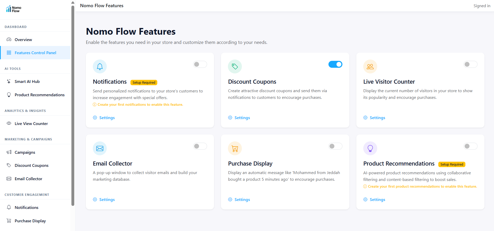
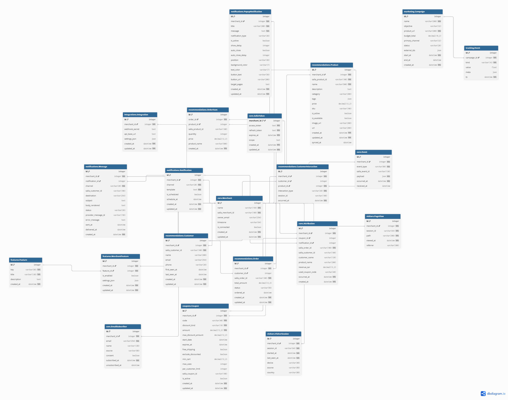

<div align="center">

# ⚡ Nomo Flow

### Smart Marketing Toolkit for Salla Stores


**Coupons • Notifications • Live Counter • Email Collector • Recent Purchases • Social Ad Campaigns**

[🚀 Features](#-features) • [📸 Screenshots](#-screenshots) • [🏗️ Architecture](#️-architecture) • [🇸🇦 عربي](#-عربي)

</div>

---

## Features

<table>
<tr>
<td width="50%">

### Coupon Engine
Create, issue, and track discount codes with usage limits, expiration dates, and per-customer restrictions. Syncs directly with Salla's coupon system.

### Notifications Center
On-site alerts and popups targeted by page, device, or visitor behavior. Boost conversions with timely messages.

### Live Visitor Counter
Real-time widget showing current store visitors. Creates urgency and social proof for your customers.

</td>
<td width="50%">

### Email Collector
Popup forms with double opt-in and exportable CSV lists. Grow your marketing list automatically.

### Recent Purchases Ticker
Social proof widget displaying latest orders on your storefront. "Someone just bought..." notifications.

### Campaign Launcher
Publish ads to **TikTok**, **Snapchat**, and **Instagram** from one unified dashboard.

</td>
</tr>
</table>

### Additional Capabilities

-  **Salla OAuth 2.0** — Seamless connect/callback flow with secure token storage
-  **Webhook Receiver** — Auto-processes `app.store.authorize` and order events
-  **Attribution Tracking** — UTM parameters and click-to-order matching
-  **A/B Testing** — Auto-tune widget variants with built-in optimizer
-  **Multi-Merchant** — Handle multiple stores from a single installation

---

## 📸 Screenshots

### Dashboard Overview
> Real-time analytics, sales performance, and feature controls in one place



---

### Campaign Builder
> Create and launch social media ad campaigns across multiple platforms


---

### Storefront Widget
> Live notifications and social proof widgets embedded on your Salla store


---

## Architecture

### Database Schema



### Project Structure

```
Nomo-Flow/
├──  README.md
├──  requirements.txt
│
└── NomoFlow/
    ├── manage.py                    # Django entry point
    ├── db.sqlite3                   # Dev database
    │
    ├── NomoFlow/                    # Project settings
    │   ├── settings.py              # Environment-driven config
    │   ├── urls.py                  # Root URL router
    │   └── wsgi.py / asgi.py
    │
    ├── core/                        #  Landing page & public site
    ├── integrations/                #  Salla OAuth & webhooks
    ├── coupons/                     #  Coupon management
    ├── notifications/               #  Alerts & popups
    ├── visitors/                    #  Session & page tracking
    ├── recommendations/             #  Product & customer data
    ├── marketing/                   #  Ad campaigns
    ├── tracking/                    #  Event attribution
    ├── features/                    #  Feature flags
    └── dashboard/                   #  Admin UI
```

### Tech Stack

| Layer | Technology |
|-------|------------|
| **Backend** | Django 5.x, Django REST Framework |
| **Database** | SQLite (dev) / PostgreSQL (prod) |
| **Frontend** | HTML5, CSS3, JavaScript, Chart.js |
| **Auth** | Salla OAuth 2.0 |

---


## 🇸🇦 عربي

<div dir="rtl" align="right">

### نومو فلو — أدوات تسويقية ذكية لمتاجر سلة

مشروع **Nomo Flow** متوافق مع منصة **سلة** ويقدم مجموعة أدوات تسويقية متكاملة:

| الميزة | الوصف |
|--------|-------|
|  **الكوبونات** | إنشاء وتتبع أكواد الخصم مع حدود الاستخدام |
|  **التنبيهات** | رسائل منبثقة مستهدفة حسب الصفحة والجهاز |
|  **عداد الزوار** | عرض لحظي لعدد الزوار الحاليين |
|  **جامع الإيميلات** | نوافذ اشتراك مع تأكيد مزدوج |
|  **آخر المشتريات** | إشعارات "شخص ما اشترى للتو..." |
|  **الحملات الإعلانية** | إطلاق إعلانات على تيك توك وسناب شات وإنستغرام |

الواجهة تدعم اللغة العربية والإنجليزية مع إمكانية التبديل بينهما بسهولة.

</div>

---